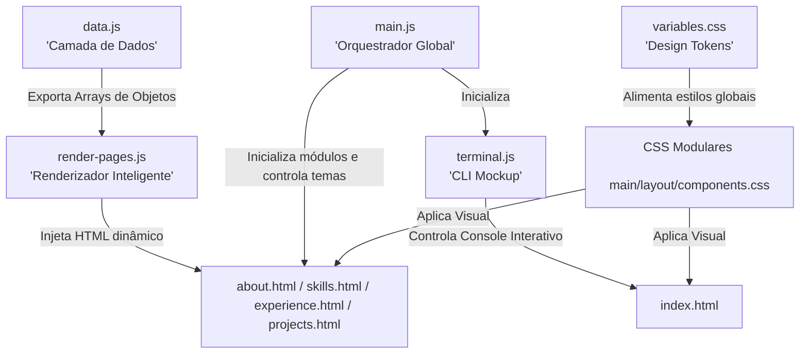

# 💻 Portfólio Profissional | Giovanni Savassa

<p align="center">
  
  
  
  
  
  
</p>

---

## 📌 Sobre o Projeto

Este repositório contém o código-fonte do **Portfólio Profissional de Giovanni Savassa**, projetado especificamente para atração de talentos de alto nível técnico e recrutadores de TI. O projeto foi desenvolvido sob os mais rigorosos padrões de **Engenharia de Software (SOLID)** e **Acessibilidade/Experiência do Usuário (UX/UI)**.

O resultado é uma aplicação web rápida, moderna, responsiva, com suporte nativo a temas (Dark/Light) e **100% dinâmica**, onde a camada de conteúdo visual é completamente isolada da lógica de renderização e estrutura da página.

---

## 🛠️ Arquitetura do Projeto & Princípios SOLID

Diferente de portfólios comuns estruturados em arquivos HTML estáticos gigantescos, este projeto foi desenhado sob uma **arquitetura limpa, desacoplada e distribuída em múltiplas páginas**.



### Como o SOLID é Aplicado na Prática:

1. **S - Single Responsibility Principle (Princípio da Responsabilidade Única):**
   - Cada arquivo HTML (`index.html`, `about.html`, etc.) é responsável apenas por estruturar a sua respectiva seção.
   - `data.js` tem a **única** responsabilidade de armazenar as informações profissionais estruturadas.
   - `render-pages.js` tem a **única** responsabilidade de mapear e renderizar os dados nas páginas correspondentes de forma limpa.
   - `terminal.js` tem a **única** responsabilidade de controlar o console/terminal interativo da Home.
   - `main.js` gerencia eventos globais (responsividade de menus, persistência do tema e feedback de cópia de e-mail).

2. **O - Open/Closed Principle (Princípio Aberto/Fechado):**
   - O sistema está **fechado para modificação** do código de apresentação, mas **aberto para extensão** do conteúdo. 
   - Se o Giovanni realizar um novo curso ou mudar de emprego, ele apenas adiciona o novo registro ao arquivo `data.js` e a interface correspondente se reconstrói sozinha, sem precisar editar as tags HTML.

---

## 🎨 Decisões de Design (UX/UI Premium)

- **Dark-First Moderno:** O portfólio inicia em um tema escuro premium (`#080c14`), reduzindo a fadiga visual. O usuário pode alternar para o tema Claro a qualquer momento, e a preferência é gravada no navegador (`localStorage`).
- **Terminal Interativo (CLI Mockup):** Um terminal de comandos totalmente funcional na Home onde recrutadores técnicos podem digitar comandos como `help`, `about`, `skills`, `experience`, `projects` e `contact` para navegar de maneira integrada e divertida.
- **Micro-Interações Fluidas:** Hover com elevação de cards, botões com gradientes interativos, e efeito de cópia rápida no botão de e-mail.
- **Glassmorphism:** Cabeçalho fixo com `backdrop-filter: blur(12px)` gerando o efeito de vidro translúcido ao rolar a página.

---

## 📂 Estrutura de Pastas

```text
giovanni-savassa-portfolio/
│
├── index.html                  # Home Page (Apresentação & Terminal CLI)
├── about.html                  # Sobre Mim (Biografia expandida & Fatec)
├── skills.html                 # Competências Técnicas (Grade detalhada)
├── experience.html             # Experiência Profissional (Linha do tempo interativa)
├── projects.html               # Projetos de Destaque (Filtro por categorias)
├── contact.html                # Contato (Canais de comunicação)
├── portfolio-content.md        # Conteúdo estruturado em Markdown para uso externo
├── README.md                   # Documentação detalhada técnica (Este arquivo)
│
└── assets/
    ├── css/
    │   ├── variables.css       # Design tokens (Cores, Fontes, Margens, Transições)
    │   ├── main.css            # Reset de estilos globais e classes utilitárias
    │   ├── layout.css          # Estilização de Cabeçalho, Footer e Menu Drawer
    │   └── components.css      # Estilização de Cards, Botões, Badges, Terminal e Timeline
    │
    └── js/
        ├── data.js             # Banco de dados local (Experiências, Projetos, Skills)
        ├── render-pages.js     # Renderização condicional inteligente do DOM por página
        ├── terminal.js         # Lógica do simulador de terminal de comandos da Home
        └── main.js             # Orquestrador de eventos, temas e interatividade global
```

---

## 🚀 Como Executar Localmente

Como o projeto utiliza **Módulos ES6 nativos** (`import`/`export`), os navegadores exigem que a aplicação rode sob um servidor HTTP local por razões de segurança.

Escolha uma das formas simples abaixo para iniciar:

### Opção 1: Servidor Nativo PowerShell (Recomendado para Windows)
Se estiver no Windows, você pode rodar o servidor web nativo .NET criado especialmente para evitar bloqueios de rede corporativos. No PowerShell, execute:
```powershell
powershell -File C:\Users\alessandro.meneses.Automotion\.gemini\antigravity\brain\afe39f32-8d1d-4c6d-9d87-b17a1792c2cb\scratch\server.ps1
```
Abra o navegador em: `http://127.0.0.1:8082`.

### Opção 2: VS Code (Live Server)
1. Instale a extensão **Live Server** no VS Code.
2. Clique com o botão direito no `index.html`.
3. Selecione **"Open with Live Server"**.

### Opção 3: Python
Se você possui o Python instalado e nenhuma regra de rede bloqueando, execute no terminal:
```bash
python -m http.server 8000
```
Abra o navegador em: `http://localhost:8000`.

---

## 🛠️ Como Atualizar o Conteúdo do Portfólio

Para atualizar as informações exibidas no site, abra o arquivo `assets/js/data.js` e altere os objetos exportados:

### 1. Atualizar Biografia
Modifique o campo `biography`:
```javascript
export const aboutData = {
    biography: "Sua nova biografia de nível Master/Sênior..."
};
```

### 2. Adicionar Novas Competências
Insira tags ou novas categorias no array `skillsData`:
```javascript
{
    title: "Nova Categoria",
    icon: "bx-code-block", // Classe de ícone do Boxicons
    tags: ["Tecnologia A", "Tecnologia B", "Processo C"]
}
```

### 3. Inserir Nova Experiência Profissional
Adicione um novo objeto no topo do array `experienceData`:
```javascript
{
    role: "Analista Sênior de Redes",
    company: "Empresa Exemplo S.A.",
    period: "Junho de 2026 - Presente",
    bullets: [
        "Liderança técnica na implantação da infraestrutura X.",
        "Redução de custos operacionais em 20% com automações de rede."
    ]
}
```

---

## 🌐 Guia de Implantação (Deployment no GitHub Pages)

Para publicar o portfólio online gratuitamente utilizando o **GitHub Pages**, siga estes passos:

1. **Crie um repositório vazio no GitHub** com o nome `giovanni-savassa-portfolio` (ou o nome de sua preferência).
2. **Inicie o Git localmente** e faça o commit inicial:
   ```bash
   git init
   git add .
   git commit -m "feat: estrutura inicial do portfólio SOLID/UX"
   ```
3. **Vincule ao seu repositório remoto** e envie os arquivos (substitua pelo seu usuário do GitHub):
   ```bash
   git remote add origin https://github.com/SEU_USUARIO/giovanni-savassa-portfolio.git
   git branch -M main
   git push -u origin main
   ```
4. **Ative o GitHub Pages**:
   - No GitHub, vá nas **Settings** (Configurações) do repositório.
   - Na barra lateral esquerda, clique em **Pages**.
   - Na seção *Build and deployment*, defina a Source como **Deploy from a branch**.
   - Selecione a branch `main` e a pasta `/ (root)`. Clique em **Save**.
5. **Pronto!** Em cerca de 1 a 2 minutos, seu portfólio estará online no endereço `https://SEU_USUARIO.github.io/giovanni-savassa-portfolio/`.

---

## 📄 Licença

Este projeto está sob a licença MIT. Consulte o arquivo [LICENSE](LICENSE) para obter mais detalhes.

---

<p align="center">
  Desenvolvido com 💙 para destacar talentos na área de tecnologia.
</p>
