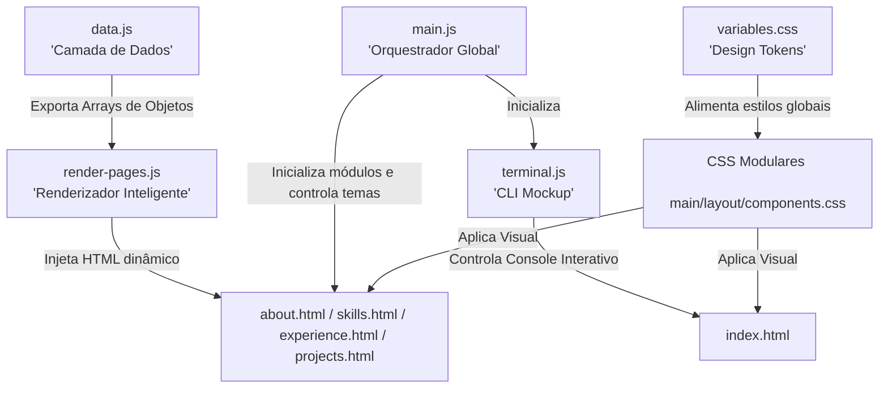

# 💻 Portfólio Profissional de Alto Impacto | Giovanni Savassa

<p align="center">
  
  
  
  
  
  
</p>

---

## 📌 Sobre o Projeto

Este repositório contém o código-fonte do **Portfólio Profissional de Giovanni Henrique Savassa**, projetado especificamente como uma vitrine de alto impacto para atração de talentos de TI e recrutadores técnicos. O projeto foi estruturado sob os mais rígidos padrões de **Engenharia de Software (SOLID)** e **Experiência do Usuário (UX/UI)**.

A aplicação funciona como uma Single Page Experience simulada usando múltiplas páginas (MPA) rápidas, modernas, responsivas, com suporte nativo a temas (Dark/Light persistente) e **100% dinâmica**, onde a camada de dados é isolada da lógica de renderização do DOM.

---

## 🛠️ Arquitetura do Projeto & Princípios SOLID

Diferente de portfólios comuns que misturam dados pessoais e marcação HTML estática, esta aplicação separa as responsabilidades de forma clara e escalável:



### Como o SOLID é Aplicado na Prática:

1. **S - Single Responsibility Principle (Princípio da Responsabilidade Única):**
   - Cada arquivo possui uma única responsabilidade. `data.js` centraliza o conteúdo. `render-pages.js` realiza inserções dinâmicas de tags e listas. `terminal.js` isola a interatividade da CLI. `main.js` orquestra o estado do tema e do menu Drawer.
2. **O - Open/Closed Principle (Princípio Aberto/Fechado):**
   - O código do renderizador e do layout está **fechado para modificação**, mas **aberto para extensão**. Para adicionar novos cursos, certificações ou experiências profissionais, basta editar o arquivo de dados (`data.js`) sem precisar alterar nenhuma linha de tag estrutural nos arquivos HTML.

---

## 🎨 Decisões de Design (UX/UI Premium)

- **Dark-First Moderno:** O portfólio inicia em um tema escuro premium (`#080c14`), reduzindo a fadiga visual. A preferência de tema é gravada no navegador do usuário via `localStorage`.
- **Terminal Interativo (CLI Mockup):** Um console de comandos integrado na Home simulando um shell Linux. Permite comandos como `help`, `about`, `skills`, `experience`, `projects` e `contact` para navegação imersiva e divertida de recrutadores.
- **Métricas Quantificativas de Impacto:** O Sobre Mim exibe indicadores reais dos impactos gerados em infraestrutura, como o downtime de rede e a vida útil média de estações de trabalho de antigos cargos.
- **Glassmorphism:** Cabeçalhos e cards translúcidos com `backdrop-filter: blur(12px)` e efeitos de brilho em degradê que reagem dinamicamente à movimentação do mouse.

---

## 📂 Estrutura de Pastas

```text
giovanni-savassa-portfolio/
│
├── index.html                  # Home Page (Apresentação & Terminal CLI)
├── about.html                  # Sobre Mim (Biografia, Metas e Idiomas)
├── skills.html                 # Competências Técnicas (Grade de Competências)
├── experience.html             # Experiência Profissional (Timeline Interativa)
├── projects.html               # Projetos de Destaque (Cases: Desafio, Solução e Impacto)
├── contact.html                # Contatos (Redes e links rápidos de envio)
├── server.ps1                  # Servidor local leve e portátil em PowerShell
├── portfolio-content.md        # Currículo completo estruturado em Markdown
└── README.md                   # Documentação técnica detalhada (Este arquivo)
│
└── assets/
    ├── css/
    │   ├── variables.css       # Design tokens (Cores, Fontes, Margens, Transições)
    │   ├── main.css            # Reset de estilos globais e classes utilitárias
    │   ├── layout.css          # Estilização de Cabeçalho, Footer e Menu Drawer
    │   └── components.css      # Estilização de Cards, Botões, Badges, Terminal e Timeline
    │
    └── js/
        ├── data.js             # Banco de dados local (Experiências, Projetos, Skills)
        ├── render-pages.js     # Renderização condicional inteligente do DOM por página
        ├── terminal.js         # Lógica do simulador de terminal de comandos da Home
        └── main.js             # Orquestrador de eventos, temas e interatividade global
```

---

## 🚀 Como Executar Localmente

Navegadores modernos exigem um servidor HTTP local para carregar os módulos nativos do ES6 (`import`/`export`) por questões de segurança de arquivo local (`CORS`).

Você pode iniciar o projeto de forma extremamente simples com as seguintes opções:

### Opção 1: Servidor Portátil em PowerShell (Recomendado para Windows)
O projeto inclui um servidor HTTP nativo e portátil na raiz. Para rodar, abra o PowerShell no diretório do projeto e execute:
```powershell
./server.ps1
```
Abra o navegador em: `http://127.0.0.1:8082`.

### Opção 2: VS Code (Live Server)
1. Instale a extensão **Live Server** no VS Code.
2. Clique com o botão direito no `index.html`.
3. Selecione **"Open with Live Server"**.

### Opção 3: Python (Qualquer Sistema)
Execute o comando abaixo no terminal da pasta do projeto:
```bash
python -m http.server 8000
```
Abra o navegador em: `http://localhost:8000`.

---

## 🛠️ Como Atualizar o Conteúdo do Portfólio

Para atualizar as informações exibidas no site, abra o arquivo `assets/js/data.js` e altere os objetos exportados:

### 1. Atualizar Biografia
Modifique o campo `biography`:
```javascript
export const aboutData = {
    biography: "Nova biografia profissional..."
};
```

### 2. Inserir Nova Experiência Profissional
Adicione um novo objeto no topo do array `experienceData`:
```javascript
{
    role: "Seu Cargo Técnico",
    company: "Nome da Empresa",
    period: "Período de Atuação",
    bullets: [
        "Responsabilidade A com impacto quantificável.",
        "Tecnologia B implementada com sucesso."
    ]
}
```

---

## 🌐 Guia de Implantação (Deployment no GitHub Pages)

Para publicar o portfólio online gratuitamente utilizando o **GitHub Pages**:

1. Crie um repositório no seu GitHub com o nome `giovanni-savassa-portfolio`.
2. Vincule seu repositório local e faça o upload do código:
   ```bash
   git init
   git add .
   git commit -m "feat: design premium e dados de currículo atualizados"
   git remote add origin https://github.com/SEU_USUARIO/giovanni-savassa-portfolio.git
   git branch -M main
   git push -u origin main
   ```
3. Ative o GitHub Pages:
   - No painel do GitHub, clique em **Settings** (Configurações) no menu superior.
   - Na barra lateral esquerda, clique em **Pages**.
   - Defina a branch como `main` e a pasta como `/ (root)`.
   - Clique em **Save**.
4. Em cerca de 1 minuto, o site estará disponível publicamente no link fornecido pelo GitHub (geralmente `https://SEU_USUARIO.github.io/giovanni-savassa-portfolio/`).

---

## 📄 Licença

Este projeto está licenciado sob a licença MIT - consulte o arquivo [LICENSE](LICENSE) para obter detalhes.

---

<p align="center">
  Desenvolvido com 💙 para destacar talentos e simplificar contratações técnicas.
</p>
